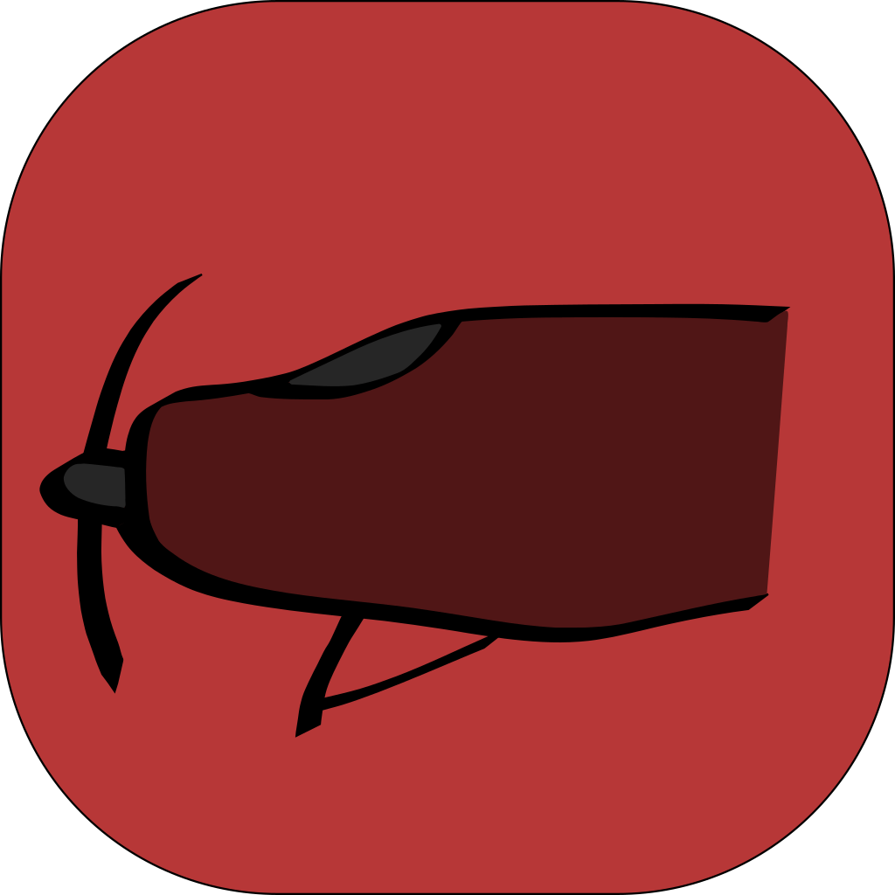

  
  <h1 align="center">Helico</h1>

Helico is another Reddit Client for Ubuntu Touch. While it relies on Lomiri QML Imports, the C++ code was designed to be at least somewhat OS agnostic, and should therefore be fairly portable to other (mobile) operating systems.

## License

Copyright (C) 2022  Alexander Richards

Licensed under the MIT license
